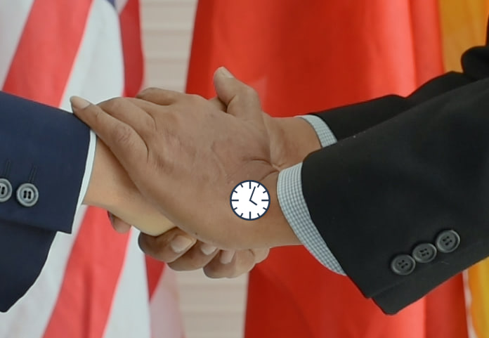

# HandWatchOverlay

Репозиторий **HandWatchOverlay** представляет собой программное обеспечение, разработанное для наложения изображения
часов на видеопоток с помощью алгоритмов компьютерного зрения. Это приложение предназначено для работы с камерой или
видеофайлом, обнаруживает руку на изображении с помощью библиотеки MediaPipe, а затем налагает изображение часов на
запястье. Программа поддерживает изображения часов с прозрачным фоном в формате PNG, что позволяет сохранять
естественный вид руки и окружающего фона.

## Основные функции

- Использование технологии OpenCV.
- Обнаружение руки и ее ключевых точек с помощью библиотеки MediaPipe.
- Наложение изображения часов на обнаруженное запястье с сохранением пропорций и прозрачности.
- Возможность работы как с видеопотоком, так и с видеофайлом.

### Горячие клавиатуры:

- Переключить на другие виды часы `S`
- Прервать работу - `Q`

## Демонстрация




## Установка

1. Клонируйте репозиторий:

```bash
git clone https://github.com/RedAlexDad/HandWatchOverlay.git
```

